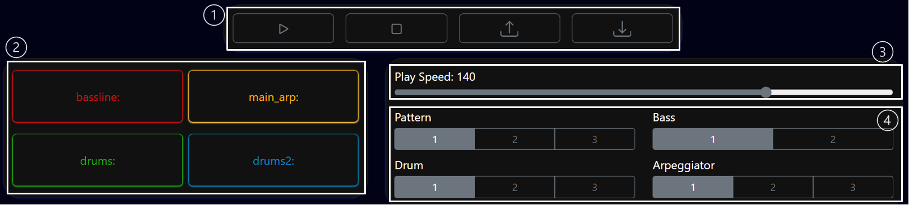
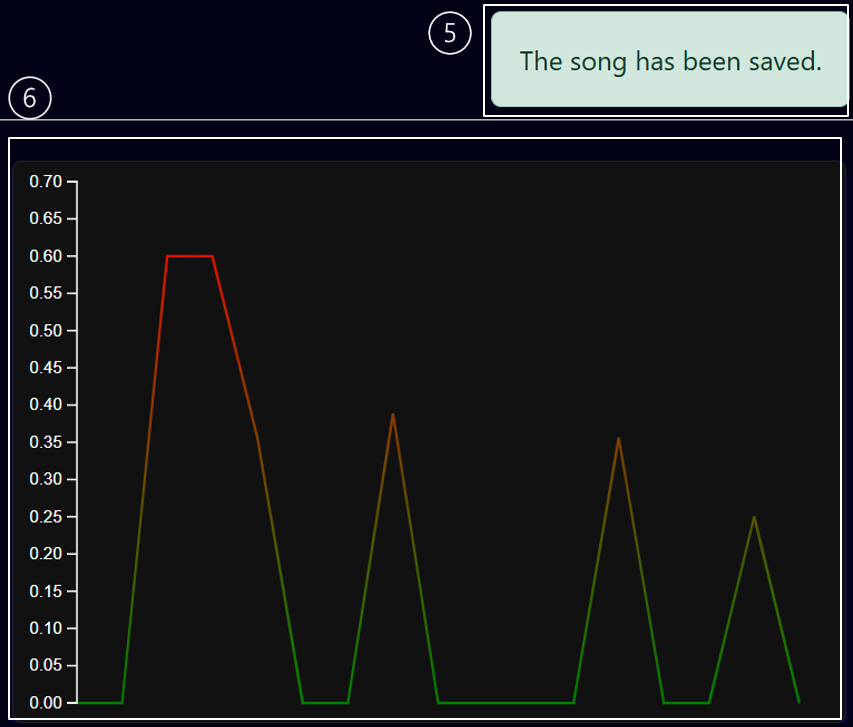

# INFT 2064 Web Tech - React Assignment

This assignement was about creating a react-based front-end application that using Strudel.cc to create live music coding.

## Run Locally

Clone the project

```bash
  git clone https://github.com/ABawden2/strudel_reactor
```

Go to the project directory

```bash
  cd strudel_reactor
```

Install dependencies

```bash
  npm install
```

Start the server

```bash
  npm start
```


## Control Functionality




**1. Nav Bar Buttons**

* Play: Starts playing the song and it it makes the graph display values.
* Pause: Stops the song from playing.
* Save: Saves the current song track to local storage.
* Load: Loads the saved song from local storage into the page, and automatically changes the button values to match the saved songs button values.

**2. Check Boxs**

The checkbox are used to mute and unmute the listed elements. To mute the element an underscore ( _ ) is added infront of the instruments contrustor.

**3. Slider**

The slider is used the change the speed of the song by altering the first value of the setcps element.

**4. Radio Buttons**

The radio buttons alter the selected option based on the radio. Each option has different tracks that can be used, resulting in the song sounding different. By selecting the different number options the different track is attached to the instruments, making the song different.


**5. Alert**

An alert is used to inform the user that they track they have made has been saved to local storage. This provides them with feedback infroming them that the element has worked correctly, otherwise they would not know if the song had actually been saved.


**6. Graph**

The graph display the room value for all the elements and shows how it changes as the song is played.


## Project Quirks
The buttons automatically update their value when you load in a saved file, or you manually select and change the button. They do not change however when you manually override the value in the code window.

Only one song can be saved at one time. When the song is saved is overrides the current local storage item.


## Video Link:
[https://mymailunisaedu-my.sharepoint.com/:v:/g/personal/baway008_mymail_unisa_edu_au/IQD15FWo11dpS6CsBQk3QFFeAeMUCERvJiyA-IT15t2385s?e=8HuTpa]


## Sources used:
The section where I used useImperativeHandle, I got my understanding from both these sources:
[https://react.dev/reference/react/useImperativeHandle]
[https://stackoverflow.com/questions/37949981/call-child-method-from-parent]

To understand how to use multiple element/ components in the one useref i used this link:
[https://www.dhiwise.com/blog/design-converter/react-multiple-refs-manage-refs-in-components-easily]
